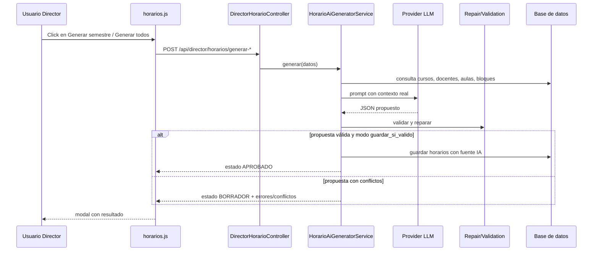

# Director - flujo de los botones "Generar semestre" y "Generar todos los semestres"

## Botones involucrados

Los botones están definidos en:

- `resources/views/director/horarios/partials/header.blade.php`

IDs:

- `dir-horarios-generar-semestre`
- `dir-horarios-generar-todos`

## Qué endpoint usa cada botón

En `resources/js/director/horarios.js:513-514` se conectan así:

- `Generar semestre` -> `POST /api/director/horarios/generar-semestre`
- `Generar todos los semestres` -> `POST /api/director/horarios/generar-todos`

Las rutas están registradas en `routes/web.php:199-204` dentro del grupo `prefix('api/director')` y requieren usuario autenticado con rol `director`.

## Flujo frontend

La función que ejecutan ambos botones es `generarIA(endpoint)` en `resources/js/director/horarios.js:427`.

### Paso 1. Lee filtros actuales

Usa:

- `filtrosActuales()` en `resources/js/director/horarios.js:11`
- `idPeriodoSeleccionado()` en `resources/js/director/horarios.js:24`

Envía este payload JSON:

```json
{
  "id_programa": 123,
  "id_periodo": 5,
  "semestre": "III"
}
```

Notas:

- Si no hay `id_programa` o `id_periodo`, no llama al backend y muestra el mensaje: "Seleccione un programa y un periodo académico antes de generar con IA."
- El frontend no envía `provider`, `modo` ni `max_intentos_reparacion`, aunque el backend sí soporta esos campos.

### Paso 2. Abre el modal de resultado

Antes del `fetch`, el JS:

- abre el modal IA
- cambia el estado a `Generando propuesta...`
- pinta una fila temporal `Generando...`

### Paso 3. Llama al endpoint

`fetch(endpoint, { method: 'POST', ... })`

Según el botón:

- `/api/director/horarios/generar-semestre`
- `/api/director/horarios/generar-todos`

### Paso 4. Pinta respuesta

La respuesta se procesa en `pintarResultadoIa(data)` en `resources/js/director/horarios.js:374`.

El modal muestra:

- estado de la generación
- modelo/proveedor usado
- bloques propuestos (`detalles`)
- observaciones
- conflictos / errores

Además habilita estos botones secundarios:

- `Aprobar` -> `POST /api/director/horarios/ia/{idGeneracion}/aprobar`
- `Descartar` -> `POST /api/director/horarios/ia/{idGeneracion}/descartar`
- `Reparar` -> `POST /api/director/horarios/ia/{idGeneracion}/reparar`

## Flujo backend

### 1. Rutas

`routes/web.php:199-204`

- `POST /api/director/horarios/generar-semestre`
- `POST /api/director/horarios/generar-todos`
- `POST /api/director/horarios/ia/{idGeneracion}/aprobar`
- `POST /api/director/horarios/ia/{idGeneracion}/descartar`
- `POST /api/director/horarios/ia/{idGeneracion}/reparar`
- `GET /api/director/horarios/ia/{idGeneracion}/estado`

### 2. Controlador

`app/Http/Controllers/Director/DirectorHorarioController.php`

- `generateSemester()` en `:114`
- `generateAllSemesters()` en `:123`
- `aprobarGeneracionIa()` en `:132`
- `descartarGeneracionIa()` en `:137`
- `repararGeneracionIa()` en `:142`
- `estadoGeneracionIa()` en `:147`

Comportamiento:

- `generateSemester()` manda al servicio exactamente lo validado por el request.
- `generateAllSemesters()` fuerza `semestre => null`, o sea genera para todo el programa.

### 3. Validación del request

`app/Http/Requests/Horarios/GenerateHorarioIaRequest.php:17-22`

Campos aceptados:

- `id_programa` obligatorio
- `id_periodo` obligatorio
- `semestre` opcional: `I` a `VI`
- `provider` opcional: `gemini`, `grok`, `fake`
- `modo` opcional: `borrador`, `guardar_si_valido`
- `max_intentos_reparacion` opcional

### 4. Servicio principal

`app/Services/Horarios/HorarioAiGeneratorService.php`

Entrada principal:

- `generar()` en `:34`

Flujo interno:

1. Arma filtro con `id_programa`, `id_periodo` y `semestre`.
2. Define `modo = guardar_si_valido` por defecto (`:41`).
3. Define provider por configuración si no llega en request (`:57`).
4. Construye contexto y prompt.
5. Crea un registro en `HorarioIaGenerado` con estado inicial `BORRADOR`.
6. Llama al provider LLM.
7. Parsea la respuesta JSON.
8. Valida conflictos y reglas institucionales.
9. Intenta reparar automáticamente si hay conflictos.
10. Si queda válido y el modo es `guardar_si_valido`, persiste en `horarios` y cambia a `APROBADO` (`:170-172`).
11. Si no queda válido, deja la generación en `BORRADOR` (`:174`).

## ¿Usa IA de verdad?

Sí, por defecto sí.

### Providers reales

Hay dos providers con llamada HTTP externa:

- `app/Services/Horarios/Providers/GeminiHorarioProvider.php`
- `app/Services/Horarios/Providers/GrokHorarioProvider.php`

Detalles:

- Gemini usa `GEMINI_API_KEY` y hace `POST` a `https://generativelanguage.googleapis.com/...:generateContent` (`GeminiHorarioProvider.php:16-26`).
- Grok usa `GROK_API_KEY` y hace `POST` a `https://api.x.ai/v1/chat/completions` (`GrokHorarioProvider.php:16-21`).

La selección por defecto sale de `config/services.php:38-51`:

- `HORARIO_LLM_PROVIDER` default: `gemini`
- `GEMINI_MODEL` default: `gemini-1.5-flash`
- `GROK_MODEL` configurable por entorno

### Provider de pruebas

También existe:

- `app/Services/Horarios/Providers/FakeHorarioProvider.php`

Ese provider:

- no hace llamadas HTTP externas
- relee el contexto embebido en el prompt
- arma una propuesta simple localmente

Está documentado en el propio archivo como "Proveedor sin llamadas HTTP" y agrega la observación `Propuesta generada por FakeHorarioProvider (sin llamada externa).`

## Cómo construye la IA la propuesta

`app/Services/Horarios/HorarioAiPromptBuilderService.php`

Puntos clave:

- `contexto()` en `:35` consulta cursos, docentes, aulas, días y bloques reales desde la BD.
- `construirPrompt()` arma un prompt con reglas estrictas.
- El prompt incluye un bloque JSON embebido entre:
  - `### CONTEXTO_DATOS_JSON_INICIO`
  - `### CONTEXTO_DATOS_JSON_FIN`

Reglas relevantes del prompt:

- no inventar IDs
- no cruzar docente
- no cruzar aula
- respetar máximo de carga docente
- evitar receso
- preferir laboratorio/taller si hay práctica

## Reparación automática

Aunque la propuesta venga de un LLM, la corrección posterior no depende del LLM.

`app/Services/Horarios/HorarioRepairService.php`

La reparación es determinista en PHP:

- mueve bloques a slots libres
- cambia aulas si el conflicto es de ambiente
- reasigna docentes si el curso no tiene docente fijo
- corrige sobrecarga semanal docente cuando es posible

O sea: la IA propone, pero la validación y parte de la corrección las hace el backend.

## Comportamiento importante que conviene saber

### 1. "Generar semestre" no obliga a elegir semestre

En frontend solo se exige `id_programa` e `id_periodo`.

Si el filtro `semestre` está vacío:

- `Generar semestre` enviará `semestre: null`
- el backend no restringirá por semestre

En la práctica, eso puede comportarse casi igual que "Generar todos los semestres".

### 2. Por defecto guarda automáticamente si queda válido

Como el frontend no manda `modo`, el servicio usa:

- `modo = guardar_si_valido` (`HorarioAiGeneratorService.php:41`)

Eso significa:

- si la propuesta queda válida tras validación/reparación, se guarda directamente en `horarios`
- el estado pasa a `APROBADO`
- el botón `Aprobar` puede ni siquiera ser necesario en ese caso

Como el frontend tampoco manda `provider`, normalmente usará el provider configurado en `HORARIO_LLM_PROVIDER`.

Esto también está cubierto por tests en:

- `tests/Feature/Horarios/HorarioAiGeneratorServiceTest.php:53-62`
- `tests/Feature/Horarios/HorarioAiGeneratorServiceTest.php:66-79`

## Resumen corto del flujo



## Archivos clave para revisar

- `resources/views/director/horarios/partials/header.blade.php`
- `resources/js/director/horarios.js`
- `routes/web.php`
- `app/Http/Controllers/Director/DirectorHorarioController.php`
- `app/Http/Requests/Horarios/GenerateHorarioIaRequest.php`
- `app/Services/Horarios/HorarioAiGeneratorService.php`
- `app/Services/Horarios/HorarioAiPromptBuilderService.php`
- `app/Services/Horarios/HorarioRepairService.php`
- `app/Services/Horarios/Providers/GeminiHorarioProvider.php`
- `app/Services/Horarios/Providers/GrokHorarioProvider.php`
- `app/Services/Horarios/Providers/FakeHorarioProvider.php`
